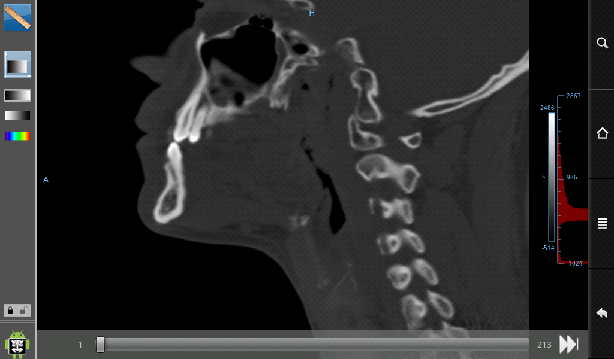

# droid-dicom-viewer
Automatically exported from code.google.com/p/droid-dicom-viewer

> Droid Dicom Viewer is a DICOM Viewer for the Android™ platform

###Disclaimer
GPLv3 logo Droid Dicom Viewer is a Free and Open Source Software (FOSS) licensed under the terms of the GNU General Public License as published by the Free Software Foundation, either version 3 of the License, or (at your option) any later version. This version of Droid Dicom Viewer is not certified as a medical device (CE-1 or FDA) for primary diagnosis or clinical practice. This software can only be used as a reviewing or scientific software and cannot be used as a medical device for primary diagnostic or any other clinical practice.

Dicom Droid Software is distributed in the hope that it will be useful, but without any warranty; without even the implied warranty of merchantability or fitness for a particular purpose. See the Droid Dicom Viewer License for more details.

###DICOM compatibility
Droid Dicom Viewer implements a part of the DICOM standard. It reads DICOM images that are coded on 8 bits and 16 bits. It supports only grayscale not compressed DICOM files. It parses implicit and explicit (little endian and big endian) value representation (VR).

###Snapshot

###Download

[Droid Dicom Viewer v1.4](Droid Dicom Viewer.apk)

###Licence

Licence
Droid Dicom Viewer is free software: you can redistribute it and/or modify it under the terms of the GNU GNU General Public License as published by the Free Software Foundation, either version 3 of the License, or (at your option) any later version. Droid Dicom Viewer is distributed in the hope that it will be useful, but WITHOUT ANY WARRANTY; without even the implied warranty of MERCHANTABILITY or FITNESS FOR A PARTICULAR PURPOSE. See the Droid Dicom Viewer License for more details.

**Droid Dicom Viewer icon license:** The Droid Dicom Viewer icon by Pierre Malarme is licensed under a Creative Commons Attribution-ShareAlike 3.0 License. The Droid Dicom Viewer icon is a modification based on work created and shared by Google and use according to terms describe in the Creative Commons 3.0 Attribution License.

**Droid Dicom Toolbar icons:** Droid Dicom Toolbar icons by Pierre Malarme are licensed under a Creative Commons Attribution-ShareAlike 3.0 License. These icons are modifications based on Android™ Templates Pack and use according to terms describe in the Apache 2.0 License.

**Droid Dicom Viewer images license:** Other Droid Dicom Viewer images by Pierre Malarme are licensed under a Creative Commons Attribution-ShareAlike 3.0 License.

**Droid Dicom Viewer documentation license:** Droid Dicom Viewer documentation by Pierre Malarme is licensed under a Creative Commons Attribution-ShareAlike 3.0 License.

Android is a trademark of Google Inc. Use of this trademark is subject to Google Permissions.

2011 © Pierre Malarme
